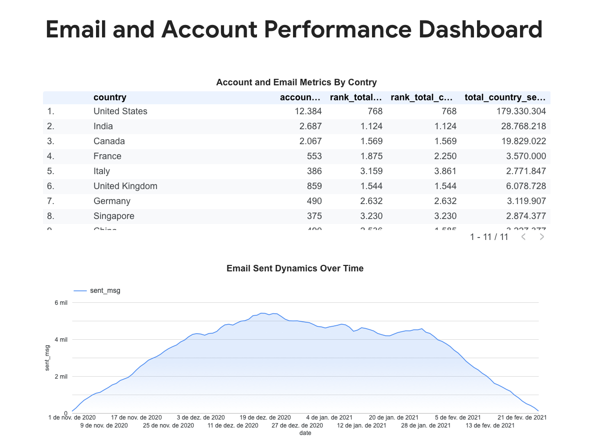

# Customer & Email Performance Analysis using SQL + Looker Studio

## 📊 Project Overview
This project analyzes customer account creation and email performance across multiple countries to identify key markets and user behavior patterns.

The analysis integrates account and email data using SQL, enabling a complete view of user engagement and activity.

## 🛠️ Skills & Tools
- SQL (CTEs, UNION ALL, Window Functions)
- Data Analysis
- Data Modeling
- Business Metrics Analysis
- Looker Studio

## 🔍 Analysis Performed
- Integrated account and email datasets using multiple CTEs
- Calculated key metrics: account creation, emails sent, opened and visited
- Aggregated data across dimensions such as country and user status
- Applied window functions to rank countries based on performance
- Identified top markets based on user activity and engagement

## 📊 Key Insights
- A small number of countries concentrate most user accounts and email activity
- Email engagement varies across different regions
- User behavior differs depending on subscription and verification status

## 💡 Business Impact
The analysis supports data-driven decisions by identifying key markets and improving email campaign performance.

## 📊 Dashboard Preview

## 🔗 Project Access
- [SQL Code](https://github.com/thaizamartins-DA/customer-email-performance-analysis/blob/main/analysis_queries.sql)
- [Dashboard](https://lookerstudio.google.com/reporting/2bd6cb61-10a0-4fe0-b211-ea67a236884c)
